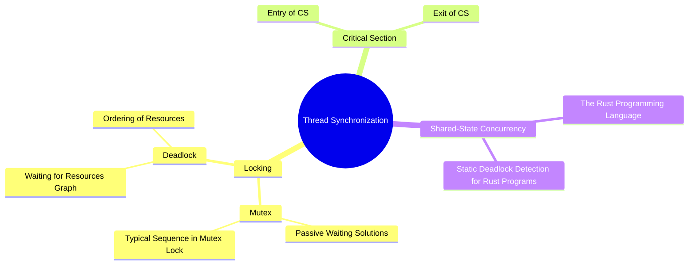

```mermaid
mindmap
root((Thread Synchronization))
  Locking
    Mutex
      Passive Waiting Solutions
      Typical Sequence in Mutex Lock
    Deadlock
      Waiting for Resources Graph
      Ordering of Resources
  Critical Section
    Entry of CS
    Exit of CS
  Shared-State Concurrency
    The Rust Programming Language
    Static Deadlock Detection for Rust Programs
```